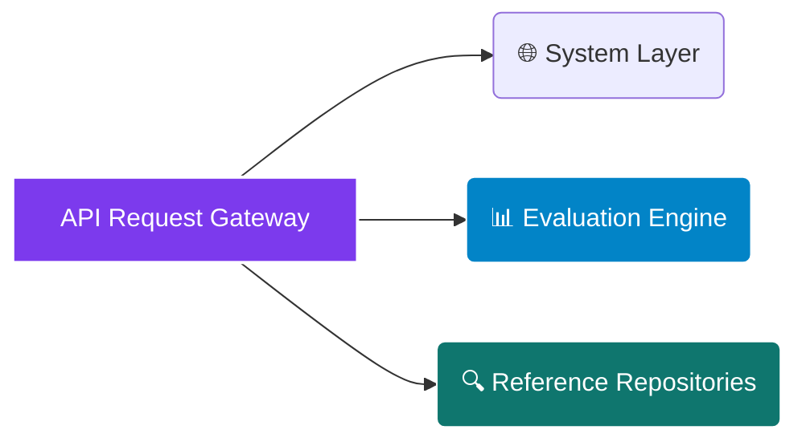

# <p align="center"></p>

<div align="center">

  <p><strong>True Rooftop Automated Detection from Lat/Lng Coordinates — Eliminating Manual Area Measuring and Opaque Screening Overhead for Commercial Portfolios</strong></p>

</div>

<div align="center">

  <a href="https://rapidapi.com/bethelnedi/api/rooftop-solar-suitability-api"></a>
  <a href="https://elements.stoplight.io/viewer/?spec=https://raw.githubusercontent.com/bethelhash/Rooftop-Solar-Suitability-API/refs/heads/main/openapi.json"></a>
  
  
  

</div>

---

## ⚡ Executive Summary

The **Rooftop Solar Suitability API** solves a core bottleneck in distributed energy scoping: the reliance on manual polygon tracing or drone surveys to acquire basic building area data. Designed for asset management platforms, solar EPCs, and sustainability consultants, this endpoint automates portfolio screening through simple latitude/longitude inputs.

By executing a targeted **OpenStreetMap Overpass API bounding box sweep**, calculating true planar areas via an equirectangular **Shoelace polygon engine**, and applying structural **IFC fire setback regulations**, the platform outputs highly accurate system sizing models, yield predictions, and financial risk profiles in **under 500ms**.

<blockquote align="left">

  <strong>💎 AUDIT-READY PHYSICAL DEFENSE</strong><br>

  Unlike black-box calculators that hide regional assumptions, this platform explicitly cites every engineering constant. From structural roof fractions (NREL Gagnon 2016) and climate performance curves (PVWatts V8) to tiered installation cost bounds (NREL ATB 2024), every output is referenceable for enterprise technical documentation and compliance reports.

</blockquote>

---

## 🏛️ Enterprise Core Capabilities

<table width="100%">
  <tr>
    <td width="50%" valign="top">
      <h3>📈 Automated Spatial Mapping</h3>
      <ul>
        <li><strong>True Zero-Input Geometry:</strong> Automatically isolates building footprint boundaries using proximity filters, avoiding manual user estimations.</li>
        <li><strong>Structural Edge Deductions:</strong> Instantly reduces footprints by applying strict International Fire Code (IFC) 2021 §1504.3 perimeter clear paths.</li>
        <li><strong>Structure Type Validations:</strong> Compares active OSM metadata tags to identify mismatch flags (e.g., sheds, carports) for clean pipeline diagnostics.</li>
      </ul>
    </td>
    <td width="50%" valign="top">
      <h3>🔌 Rigorous Financial Physics</h3>
      <ul>
        <li><strong>Tiered Cost Underwriting:</strong> Adjusts project CAPEX benchmarks dynamically based on sliding system size limits defined by NREL ATB.</li>
        <li><strong>Cross-API Connectivity:</strong> Generates immediate, downstream-ready parameters mapped to companion Solar+BESS and O&amp;M monitoring protocols.</li>
        <li><strong>Coincidence Load Calculations:</strong> Applies NREL coincidence metrics to accurately isolate demand charge reduction benefits against dynamic utility rules.</li>
      </ul>
    </td>
  </tr>
</table>

---

## 📂 API Core Endpoint Directory



---

### 🌐 System Layer

* `GET /` — Exposes active API structural indices, build versions, and configuration frameworks.
* `GET /health` — Validates real-time system operational health, proxy connectivity, and logs the peer-reviewed methodology registry.
* `GET /pricing` — Returns active platform tier restrictions, execution rate limits, and product feature inclusions.

### 📊 Evaluation Engine

* `POST /rooftop/quick` — Core spatial and physics screening hub. Processes location coordinates and building category flags to output structural footprint summaries, net usable surfaces, effective yields, and basic payback periods. *(Free Tier)*
* `POST /rooftop/full` — Deep institutional underwriting pipeline. Unlocks 25-year discounted cash flows (NPV/IRR), Jordan & Kurtz decay tables, localized HVAC obstacle margins, and automated standalone or demand-targeted BESS optimization maps. *(Pro Tier)*

### 🔍 Reference Repositories

* `GET /reference/building-types` — Returns active structural utilization parameters and building area constraints.
* `GET /reference/climate-yields` — Exposes location-specific reference yield constants across core climate zones.
* `GET /reference/suitability-thresholds` — Details structural score calculation weights and performance categories.

---

## 📈 Engineering Methodology & Verification Matrix

The application layer completely removes engineering guesswork by mapping every calculation block to peer-reviewed institutional codes:

| Calculation Block | Governing Code / Framework | Primary Academic / Institutional Source Citation |
| --- | --- | --- |
| **Building Geometry** | OpenStreetMap Overpass Mapping | OpenStreetMap Data Infrastructure Foundation (ODbL 1.0) |
| **Footprint Evaluation** | Equirectangular Shoelace Engine | Bourke, P. (1988) Polygon Area and Centroid Calculation Protocol |
| **Usable Roof Margin** | Structural Typology Fractions | Gagnon et al. (2016) National Renewable Energy Lab |
| **Fire Access Setbacks** | Clear Path Protection Bounds | International Fire Code (IFC) 2021 |
| **Solar Yield Physics** | Energy Production Assessment | NREL PVWatts V8 Performance Model Framework |
| **Shading Derates** | Solar Horizon Obscuration Models | Solargis Global Solar Atlas Technical Performance Criteria (§3.2) |
| **Orientation Factor** | Surface Vector Geometries | Duffie, J.A. & Beckman, W.A. Solar Engineering of Thermal Processes |
| **Project CAPEX Bounds** | Tiered Investment Estimators | Cole, W. & Karmakar, A. (2023) National Renewable Energy Lab |
| **Operations Logistics** | Scheduled Lifecycle Maintenance | NREL ATB Commercial Solar O&M Financial Ledger ($17–21/kW-yr) |
| **Tax Equity Allocation** | Clean Energy Investment Credits | Inflation Reduction Act (IRA) 2022 Statutory Code Guidelines §48E |
| **System Degradation** | Long-Term Materials Decay Loops | Jordan, D.C. & Kurtz, S.R. Progress in Photovoltaics |
| **Financial Yield Evaluation** | Cash Flow Valuation Standards | IRENA Renewable Power Generation Costs Institutional Ledger (2023) |
| **Coincidence Reductions** | Demand Charge Displacement | Denholm, P. et al. (2014) National Renewable Energy Lab |
| **BESS Optimization** | Co-located Battery Configuration | Denholm, P. et al. (2019) NREL/TP-6A20-74321 & EPRI Report 3002019530 |

---

## 🏢 Supported Typologies & Structural Bounds

The platform leverages structural utilization statistics to estimate true roof capacity from raw wall envelopes:

| Building Type Classification | NREL Usable Area Fraction | Primary Target Applications and Layout Rules |
| --- | --- | --- |
| `warehouse` | **0.65** | Large clear unobstructed spans, low clear hazard margins. |
| `manufacturing` | **0.60** | Industrial processing, moderate mechanical structural layout lines. |
| `school` | **0.55** | Educational facilities, extended low-rise layout footprints. |
| `retail` | **0.50** | Commercial retail environments, standard mechanical equipment configurations. |
| `multifamily` | **0.42** | Multi-tenant residential complexes, moderate layout density breaks. |
| `commercial_office` / `generic` | **0.40** | Standard commercial centers, typical multi-tier mechanical equipment space. |
| `hotel` | **0.38** | Hospitality facilities, dense structural ventilation equipment layouts. |
| `data_center` | **0.35** | High-density technology hubs, extensive cooling equipment constraints. |
| `hospital` | **0.30** | Specialized healthcare facilities, complex multi-tier roof infrastructure. |

---

## 🚀 Quickstart Integration Example (Python)

To quickly pull a programmatic feasibility assessment via the enterprise storage gateway, use the script layout below:

```python
import json
import requests

# Core Routing Configuration via RapidAPI Gateway
GATEWAY_URL = "[https://rooftop-solar-solar-suitability-api.p.rapidapi.com/rooftop/quick](https://rooftop-solar-solar-suitability-api.p.rapidapi.com/rooftop/quick)"

payload = {
    "latitude": 33.4484,
    "longitude": -112.0740,
    "state": "AZ",
    "building_type": "warehouse"
}

headers = {
    "Content-Type": "application/json",
    "X-RapidAPI-Key": "YOUR_SECURE_MARKETPLACE_TOKEN",
    "X-RapidAPI-Host": "rooftop-solar-suitability-api.p.rapidapi.com"
}

response = requests.post(GATEWAY_URL, json=payload, headers=headers)
print(json.dumps(response.json(), indent=2))

```

---

## 💎 Production Access Tiers

| Tier Classification | Monthly Access Fees | Active Rate Latency Caps | Inclusive Data Volume Quota | Programmatic Endpoint Access | Support Service Level |
| --- | --- | --- | --- | --- | --- |
| **Free Tier Core** | $0 / Month | 5 Requests / Minute | 10 Calls / Month | `/rooftop/quick` + Reference Suite | Open Community Forum |
| **Pro Enterprise** | $49 / Month | 1,000 Requests / Hour | Unlimited | Complete `/rooftop/full` System Suite | Standard Service SLA |
| **Ultra Institutional** | $199 / Month | 1,000 Requests / Hour | Unlimited | Full Access + Full White-Label Rights | Dedicated Operations SLA |

---

## 🔒 Proprietary License & Terms

### Intellectual Property Protection

**Copyright © 2026 Axiom Infrastructure Intelligence LLP. All rights reserved.**

The Rooftop Solar Suitability API, its underlying planar coordinate calculations, structural projection matrices, spatial bounding engines, data layers, and OpenAPI schemas are the exclusive proprietary intellectual property of Axiom Infrastructure Intelligence LLP. No part of this system layout, parameter mapping design, or logic schema may be copied, redistributed, white-labeled, reverse-engineered, or modified without an executed Master Services Agreement (MSA) and express written licensing permission from the corporate rights holder.

### Technical Disclaimer

All calculations, automated measurements, and financial curves generated by the core model function as pre-feasibility analysis optimized for top-of-funnel scoping, project discovery, and portfolio screening. System operators must consult a licensed professional structural engineer and a certified energy financial advisor before completing equipment procurement or executing capital placement.

```

```
